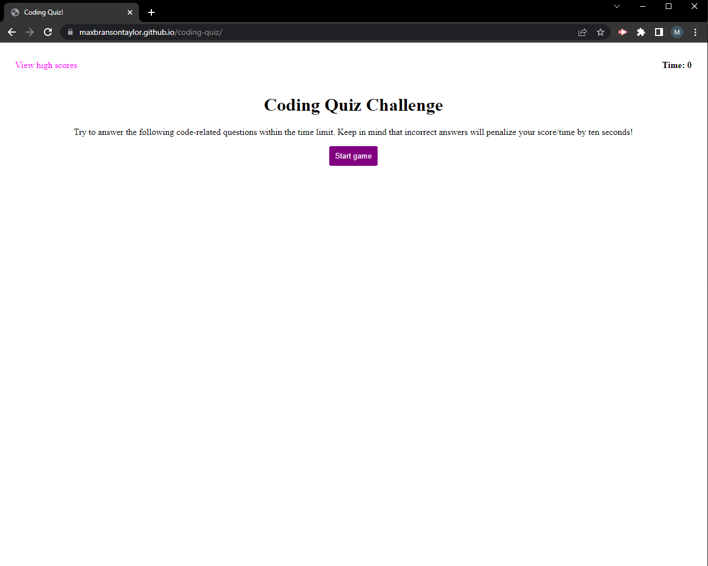

# Coding Quiz

## Description

This application is a coding quiz game that presents the user with 5 questions and a timer of 60s. Once all questions are completed or the timer reaches 0 the game will end and the user will be able to save their scores in local storage. Viewing the high scores page will show all high scores in order and provide the option to clear all scores from local storage.

[Link to deployed application](https://maxbransontaylor.github.io/coding-quiz/index.html)
